# PAGURI: PROMPT AUDIO GENERATOR USER RESEARCH INVESTIGATION

  

## Abstract 

In recent years, text-to-music models have been the biggest breakthrough in automatic music generation. While they are unquestionably a showcase of technological progress, it is not clear yet whether and how they can realistically be integrated and used as effective tools in the artistic practice of musicians and music practitioners. This paper aims to address this question via Prompt Audio Generation User Research Investigation (PAGURI), a user experience study where we leverage recent text-to-music developments to study how musicians and practitioners interact with these systems, evaluating their satisfaction levels. We developed an online tool where users are asked to generate and/or modify music samples of their choice by applying recently proposed personalization techniques, based on fine-tuning and/or prompting a text-to-music model. Through the use of questionnaires and interviews, we analyzed how participants interacted with the proposed tool. Results show that even if the audio samples generated and their quality may not always meet user expectations, the majority acknowledge consistency between input prompts and generated audio. Moreover, they express willingness to incorporate the proposed tool into their creative process. Users also offer suggestions on how the system could be improved and integrated into their music practice.

## paGUIri
The graphical user interface of PAGURI.
<figure>
  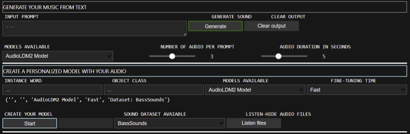
  <figcaption>1) paGUIri Graphical User Interface.</figcaption>
</figure>

<figure>
  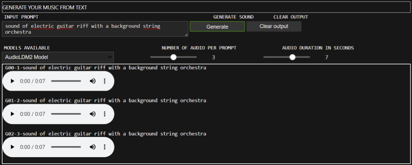
  <figcaption>2) paGUIri audio generation window.</figcaption>
</figure>

<figure>
  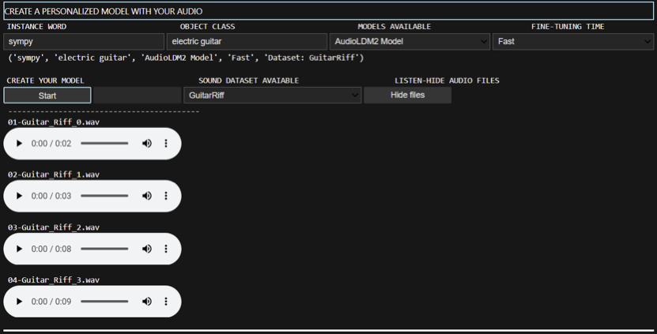
  <figcaption>3) paGUIri model personalization window.</figcaption>
</figure>

<figure>
    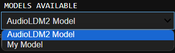
    <figcaption>4) Options: available models for generation. </figcaption>
</figure>
<figure>
    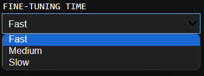
    <figcaption>5) Options: fine-tuning time.</figcaption>
</figure>

## Questionnaire Description
The answers to the questionnaires are of 5 types:
- **Type A**: multiple choice options structured on a Likert scale from 1 to 5, where each score quantifies the
level of approval in an increasing way, as shown in table 8 (appendix A.1).
- **Type B**: multiple choice options representing different time frames. This kind of answer is provided to a
question regarding the amount of time a user spends or dedicates to a specific action, as shown in table 9
(Appendix A.1).
- **Type C**: multiple choice consisting of numbers ranging from "0" to "4 or more". This kind of answer is
linked to a quantitative question. 
- **Type D**: a mixture of multiple-choice and open answers. Typically, there are one or two closed choices
("No..." or "Yes, but ...") and one open answer (identified with □: .......... ). More details regarding this
type of answer can be found in Table 11 (Appendix A.1).
- **Type O**: open answers in which the user can respond openly through text (□ : .......... )

<!-- ## Demographic Data Questionnaire and Answers -->

## Data Questionnaire and Answers

🔗 **[_Musical knowledge and experience with AI tools_ survey (questions and answers)](suvrye1.md)**

<!-- ### Musical knowledge and experience with AI tools

| ID  | Question  |  Type | 
|:---|:---|:---|
| Q1  |  I spend a lot of my free time doing music-related activities |  A |
| Q2  |  I enjoy writing about music, for example on blogs and forums |  A  |
| Q3  | If somebody starts singing a song I don’t know, I can usually join in  |  A  |
| Q4  |  I can sing or play music from memory |   |
| Q5  |  I often read or search the internet for things related to music |  A  |
| Q6  |  I am able to identify what is special about a given musical piece  |  A  |
| Q7  | I listen to music for _______ per day  | B  |
| Q8  |I engaged in regular, daily practice of a musical instrument (including voice) for ____ years| C  |
| Q9  |At the peak of my interest, I practiced _____ hours per day on my primary instrument.|  C |
| Q10  |I can play ______ musical instruments.|   C|
| Q11  |What kind of instrument can you play? Ex: piano, guitar, flute, etc...|   D|
| Q12  |I often read or search the internet for things related to AI tools.| A  |
| Q13  |AI can be a tool to support human activities.|A   |
| Q14  |Were you already aware of the existence of AI tools? Which ones ?| D  |
| Q15  |Do you use AI tools? Which ones ?| D  |
| Q16  |I’m able to use _____ programming languages.| C  |
| Q17  |I spend _______ on programming languages.|B   |
| Q18  |What is your relationship with music ?| O  |
| Q19  |Were you already aware of the existence of AI tools in text-to-music? Which ones ?|D   |
| Q20  |Do you use text-to-music AI tools ? Which ones ?| D  |

#### Answers to questions evaluated on a Likert Scale
<figure>
  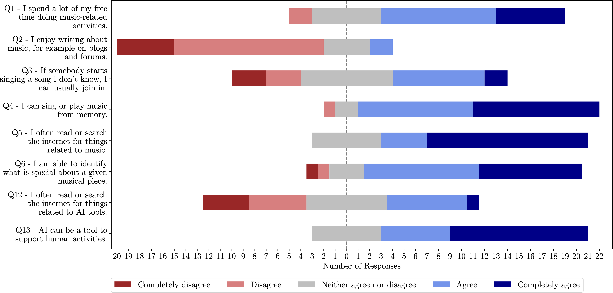
  <figcaption> Questionnaire 2 Answers (Likert)</figcaption>
</figure>

- #### Q7: _I listen to music for _______ per day_
<figure>
  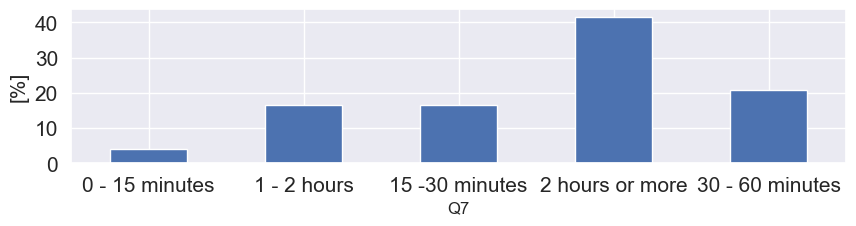
</figure>

- #### Q8: _I engaged in regular, daily practice of a musical instrument (including voice) for ____ years_
<figure>
  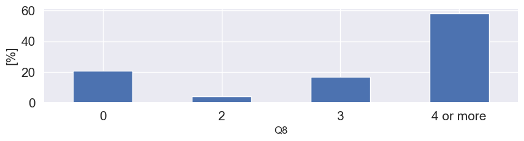
</figure>

- #### Q9: _At the peak of my interest, I practiced _____ hours per day on my primary instrument._
<figure>
  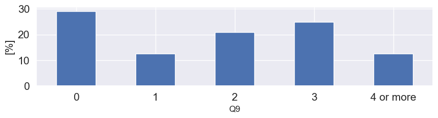
</figure>

- #### Q10: _I can play ______ musical instruments._
<figure>
  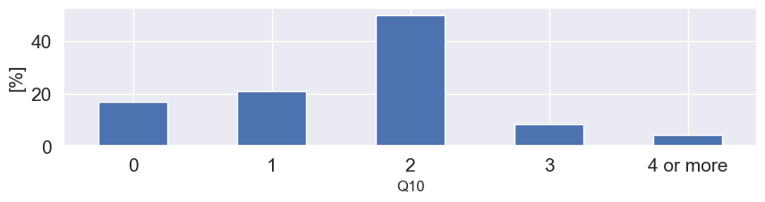
</figure>

- #### Q11: _What kind of instrument can you play? Ex: piano, guitar, flute, etc..._
<figure>
  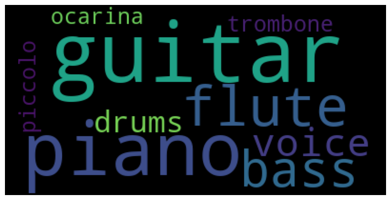
    <figcaption>N.B. 15.7 % answered  <i>I do NOT play any instrument </i></figcaption>
</figure>

- #### Q14: _Were you already aware of the existence of AI tools? Which ones?_
  <figure>
  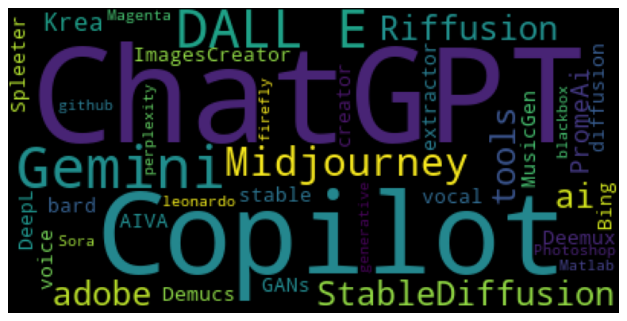
    
    <figcaption>N.B. 16.7 % answered  <i>No, I don't</i> and 8.3% answered <i>Yes, but I don’t remember the names </i></figcaption>
</figure>

- #### Q15: _Do you use AI tools? Which ones?_
  <figure>
  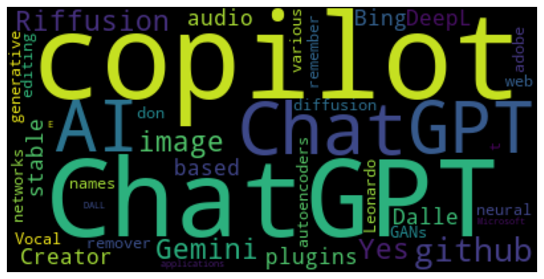
    
    <figcaption>N.B. 33.3 % answered  <i>No, I don't</i> and 4.2% answered <i>Yes, but I don’t remember the names </i></figcaption>
</figure>

- #### Q16: _I’m able to use _____ programming languages._
  <figure>
  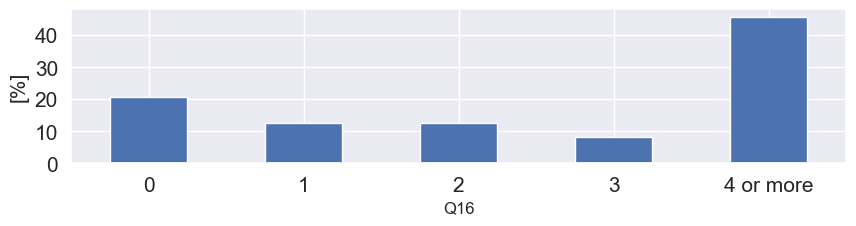
</figure>

- #### Q17: _I spend _______ on programming languages_
<figure>
  
</figure>

- #### Q18: _What is your relationship with music?_
  <figure>
  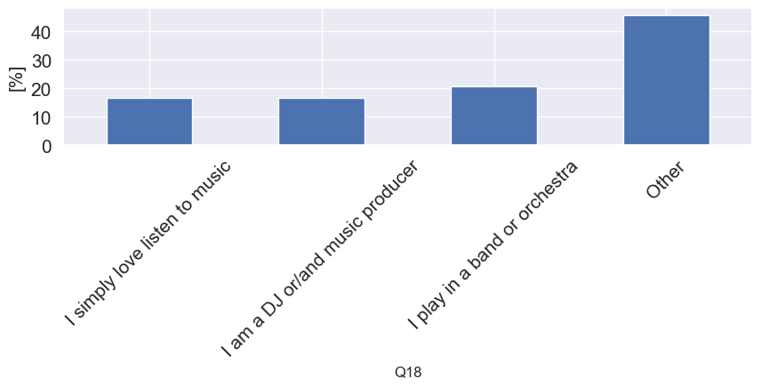
</figure>

Participants who chose *other* gave the following answers:

- Dj/Mixing Engineer

- Music producer, musician

- I simply love listen to music and play non professionally

- I am the owner of a small record label<superscript>*</superscript>

- I'm a singer and I love to listen to new stuff and new genres

- I am a dance teacher, I work with music<superscript>*</superscript>

- both listener and playing in an acoustic duo

- I study in the conservatory

- Former student, former band member, amateur arranger
  
- I am a solo artist

- Dance Teacher<superscript>*</superscript>

<superscript>*</superscript> answers translated 

- #### Q19: _Were you already aware of the existence of AI tools in text-to-music? Which ones ?_
<figure>
  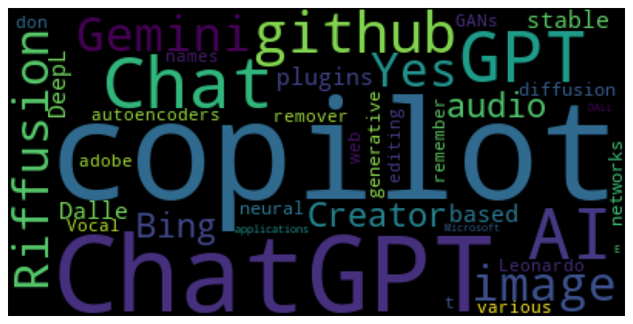
<figcaption>N.B. 37.5 % answered  <i>No, I don't</i> and 37.5% answered <i>Yes, but I don’t remember the names </i></figcaption>
</figure>

- #### Q20: _Do you use text-to-music AI tools ? Which ones ?_
<figure>
  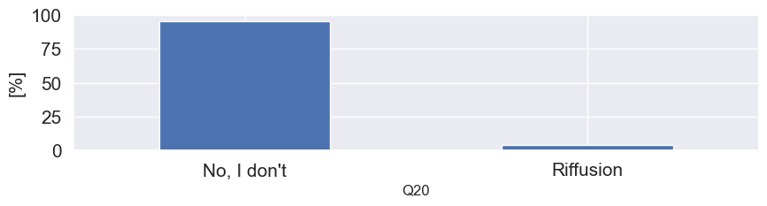
</figure>

-->

## Text-to-Music Interaction (Model Evaluation) Questionnaire and Answers

| ID  | Question  |  Type | 
|:---|:---|:---|
| Q21  |  The generated audio(s) is consistent with respect to the input prompt  |  A |
| Q22  |  The audio(s) generated is consistent with respect to my expectations |  A  |
| Q23  | The quality of the audio(s) generated is consistent with my expectations  |  A  |

- #### Answers to questions evaluated on a Likert Scale
<figure>
  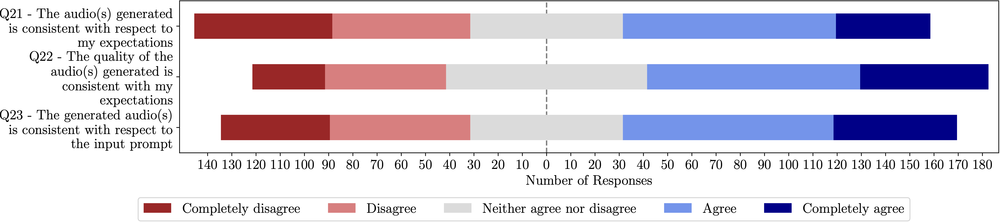
  <figcaption> Questionnaire 3 Answers (Likert)</figcaption>
</figure>

## Final Survey and Answers

| ID  | Question  |  Question type | 
|:---|:---|:---|
| Q24  | I enjoyed the interaction with the text-to-music generation system|  A |
| Q25  | The data generated by the model are consistent with respect to the desired audio file provided by the user|  A |
| Q26  | The waiting time of the fine-tuning of the model is proportionate with the quality of the generated audio|  A |
| Q27  |  The audio generated by the personalized model is better than the audio generated by the based model|  A |
| Q28  | There is consistency between input prompt and audio(s) generated|  A |
| Q29  | The use of text-to-music models can support musicians in musical creation endeavours|  A |
| Q30  | I would use this system again|  A |
| Q31  | Would you include this workflow in your music creative process? How ?|  D |
| Q32  | In what context you would use the audio generated by the model?|  O |
| Q33  | If you personalized the model, inn what context you would use the audio generated by the fine-tuned model?|  D |
| Q34  | Do you think giving the opportunity to personalize the text-to-music model with own music is good? Why?|  O |
| Q35  | Insert here your suggestions and comments|  O |

- #### Answers to questions evaluated on a Likert Scale
  <figure>
  
  <figcaption> Questionnaire 4 Answers (Likert)</figcaption>
</figure>

- #### Q31  _Would you include this workflow in your music creative process? How?_

<figure>
  
</figure>

Participants who chose *other* gave the following answers:

- Inspiration and post processing modification
 
- I would use it for inspiration purposes and for modifying in post-generation
 
-  ispiration purpose and modify after generation
 
-  I would use it for specific exercises on rhythm and improvisation based on the generated audio <superscript>*</superscript>
 
- Not at this time because the program does not process music according to my specifications <superscript>*</superscript>
 
- I would use it for inspiration, include it as it is and include it after alteration
 
<superscript>*</superscript> answers translated 

- #### Q32 _In what context you would use the audio generated by the model ?_

- Song-writing
 
- it is possible to use to generate parameters value to control a synth in order to emulate the desired sound
 
- Music making and foleys
 
- music production to produce samples that can be modified, looped and integrated in a track
 
- I would use it to aid in music production with a DAW
 
-  Beat making for music production <superscript>*</superscript>
 
- In beats and music productions, maybe soundtracks
 
- cinematic and dance music
 
- more general requests
 
-  During dance lessons <superscript>*</superscript>
 
- To create new songs by old songs and sounds.
 
- If I really like the sound, maybe I would use it in the production of a song by changing and mixing it
 
- during a production session
 
- I would use it to find inspiration when writing music, or in the context of sound design
 
- Broaden your musical culture <superscript>*</superscript>
 
- To find the inspiration when i am stuck with the writing process of a new song. Or for making memes
 
-  The base model can help to have inspiration to start<superscript>*</superscript>
 
- to compose new music
 
- Inspiration to start song/mixing ideas
 
- Music production
 
- Inspiring the composition of a piece of music
 
- to make personalized sound effects
 
- Generating drafts from a preliminary sound idea I have in my mind
 
-  I would use it to build musical bases aimed at dance choreographies <superscript>*</superscript>

<superscript>*</superscript> answers translated 

  
- #### Q33 _If you personalized the model, in what context you would use the audio generated by the fine-tuned model?_

- Producing
 
- I did not use the personalization option of the model
 
- Music making, with a more personalized sound
 
- still in music production, to produce samples or perhaps in a creative installation
 
- I'd use a fine-tuned model to try and create a specific sound I'm looking for in music production, hoping that it would save time with respect to trying to create it with traditional means
 
-  Beat making for music production <superscript>*</superscript>
 
- In beats and music productions, maybe soundtracks
 
- live music performance
 
- To create samples for my group
 
- I would not use it because it did not meet my expectations <superscript>*</superscript>
 
- To create new songs by old songs and sounds.
 
- If I look for something in particular maybe to incorporate to the procution of a song or for inspiration
 
- with synth one shots and drum loop
 
- I would using in order to write music from a particular sub-genre
 
- Entrare in campi musicali più di mio gradimento <superscript>*</superscript>
 
- To take inspiration form a certain music style, or to obtain a certain type of audio that i need 
 
- The custom model must adhere more closely to the requested specifications in order to be used  <superscript>*</superscript>
 
- to compose new music
 
- Same context
 
- Latin Music Production
 
- Eletronic music bases, sampling of old songs
 
- to make personalized sound effects
 
- Generating sounds based on sounds and patterns that I like
 
- I did not use the personalization option of the model

<superscript>*</superscript> answers translated 

- #### Q34 _Do you think giving the opportunity to personalize the text-to-music model with own music is good? Why?_

- I believe that integration of artificial intelligence can give a boost to music production, providing more opportunities for young artists
 
- maybe it could be useful in order to save your general signature sound and use it to create new sounds starting from them
 
- Yes, it's very good because gives more control on the output and creative use of my samples
 
- Yes, it further improves the quality of the model in the task of generating samples from a specific genre. Even if this means that the quality in very different genres is decreased it's not a big deal, as we can still fall back to the original model or even fine-tune it again for a different task.
 
- I think it has the potential to let musicians get realistic sounds with very little effort, but it could also be a bit risky as it could essentially allow anyone to copy any style in very little time, possibly harming the original creator (e.g. by providing much cheaper copies they can't react to in time)
 
- Yes, because that way everyone would create their own style and use it as they see fit <superscript>*</superscript>
 
- Is good because it can fit better your own music tastes
 
- yes, because it allows the user to draw a line to be followed by the model and  to get better results
 
- Yes because you can experiment mixing different types of genres listening the resulting output
 
- Yes, to satisfy specific needs or discover new sounds, but it needs to be better customizedo <superscript>*</superscript>
 
- I think is a good option for the artist to work on a different settings for their wor.
 
- Yes because it creates a lot of oportunities to the user to create and play with the model. Maybe this would hook the user to use the model more than other models that does not offer this posibility 
 
- absolutely, because it can provide signature sounds that only belongs to the artists
 
- Yes, because music tends to be really different, so a fine tuning is necessary in order to have a result that might be meaningful during the writing process, taking care of specific constraints such as harmony, rythm, etc...
 
-  Yes, because it can help artists in the composition and editing of musical bases for lyrics <superscript>*</superscript>
 
- Yes. The opportunity to personalize the text-to-music model with own music can be an opportunity to find some new alterations in what a musician play, leading to new possibilities of finding new path in the music creation process
 
- Not at this moment, because I can't play the requested music <superscript>*</superscript>
 
- yes, because the result is more likeable to the user
 
- To better tune the model towards a specific genre
 
- Yes to generate unique sounds and personalized music
 
- Yes since the output would be more likely to match personal taste and give good chances of re-intepreting our own music
 
- Yes, because its a good way to make new content to use for new stuff
 
- It is a very good idea because it can give the user the possibility to explore the sounds he/she provides in a more creative way
 
-  I have not used the model personalization, but it could be used in any context in reference to specific needs, e.g. birthday party, music for children, DJ or themed evenings, themed parties, etc...<superscript>*</superscript>

<superscript>*</superscript> answers translated 

- #### Q35 _Insert here your suggestions and comments_

- The model should have less noisy outputs and more frequencies in the spectrum of the outputs
 
- Fine tuning the model greatly increases the quality in the generation of one specific genre, but it also lowers the average quality when generating music from completely different genres.
 
- DAW integration would be great to have for my use case
 
- I enjoyed the interaction and it was very interesting, but it is still a bit immature. I think it has a lot of potential for growth. <superscript>*</superscript>
 
- in the future a combination of the model with an interacive process (the user makes a choise between n audio and next generation is conditioned by his/her choise) can be useful 
 
- Very nice work, I would suggest to try the experiment with others text to music models and compare results to analyze what is the better.
 
- We should make longer tracks and improve the sound quality, overall it was a new and beautiful experience <superscript>*</superscript>
 
- More speed (just a little bit) for the generation of my models.
 
- only generate one sound at the time and not the whole track, words ambiguity with similar meanings, improve the GUI
 
- It's a very nice tool for musicians that might get stuck finding inspiration. Probably it's still a little too complicated for someone without some technical knowledge, so in the future it might be useful to "guide" the user in some way in order to obtain better results
 
- Very pleasant experience, I enjoyed experimenting with this new tool that I had never tried before. Interesting the combinations and searches that the system does for the word-sound association.<superscript>*</superscript>
 
- I would add a list of words related to specific areas of music structure, with the corrispective description, to give the user a tool to modify specific aspect of the song in the prompt given to the model
 
- My expectation was that the model would be able to generate music following my specific specifications, regardless of the models pre-set inside it. In the specific case, I wanted it to transform the basic electric guitar riff inside it and adapt it to a riff usable with an acoustic guitar. <superscript>*</superscript>
 
-  Improve the graphical interface by adding color <superscript>*</superscript>

- improve the quality of sound in terms of sample Hz
 
- Create a VST plugin with this application, fix the generation of silence or volume attenuation that sometimes occur 
 
- The sound should be more relevant and pertinent to my requests given by the text, but overall I found the experiment interesting <superscript>*</superscript>

<superscript>*</superscript> answers translated 

🔗 **Users interactions, prompts used as input for generation, and model personalization history can be found here 👉 [User interactions with the model](interactions.md)**

