# User interactions with the model

## P1 (Music player in a band or orchestra)

| Iteration | Prompt | 
|----|-------------| 
|1|a sound of an asian flute playing a medioeval theme| 
|2|90's hip hop boom bap beat with piano and electric guitar| 
|3|hardstyle music with acoustic voice| 
|4|emo trap beat with harp and flutes| 
|5|a sound of fef with drums and bass, Eric Clapton style| 
|6|a sound of fef with rock drums and bass, Eric Clapton style| 
|7|a sound of fef with metal drums and bass, electric guitar fast riff, Iron Maiden style| 

##### Q21) The audio(s) generated is consistent with respect to my expectations
<figure>
  
</figure>

##### Q22) The quality of the audio(s) generated is consistent with my expectations
<figure>
  
</figure>

##### Q23) The generated audio(s) is consistent with respect to the input prompt
<figure>
  
</figure>

## P2 (Dj/Mixing Engineer)

| Iteration | Prompt | 
|----|-------------| 
|1|Hip-hop drums with big kick and reverb snare| 
|2|classic hip hop drums boom bap| 
|3| hip hop drums 90 bpm | 
|4|dark flute in a big chamber, emotionally | 
|5|scale of C major, piano, no reverb| 
|6|pad with slow attack, chords, modulation of lowpass filter| 
|7|screams of kids, ambience| 
|8|foley park, ambience, funny, animal| 
|9|orchestral sections, theatre, movie, suspense| 
|10|kalimba, beach, sun, love| 
|11|acoustic guitar, pop, love, bright| 
|12|solo acoustic guitar| 

##### Q21) The audio(s) generated is consistent with respect to my expectations
<figure>  </figure>

##### Q22) The quality of the audio(s) generated is consistent with my expectations
<figure>  </figure>

##### Q23) The generated audio(s) is consistent with respect to the input prompt
<figure>  </figure>

## P3 (Music producer, musician)

| Iteration | Prompt | 
|----|-------------| 
|1|Piano bar loop| 
|2|Dubstep growl| 
|3|Train passing by| 
|4|Train horn| 
|5|Ambient music| 
|6|Relaxing ambient music| 
|7|Hip hop beat| 
|8|Gigio hip hop beat| 
|9|rap drums| 
|10|dubstep drums| 
|11|gigio house drums| 
|12|house drums| 
|13|major scale guitar arpeggio| 
|14|gigio synth| 
|15|baggy synth| 
|16|baggy bass| 
|17|baggy bass shot| 
|18|a sound of baggy basses | 

Q21) The audio(s) generated is consistent with respect to my expectations
<figure>  </figure>
Q22) The quality of the audio(s) generated is consistent with my expectations
<figure>  </figure>
Q23) The generated audio(s) is consistent with respect to the input prompt
<figure>  </figure>

## P4 (Play music non professionally)

| Iteration | Prompt | 
|----|-------------| 
|1|clear and catchy disco bar lounge funky music| 
|2|bossa nova standard| 
|3|bossa nova standard| 
|4|sunset discobar lounge| 
|5|sunset lounge| 
|6|nu metal discobar| 
|7|reggaeton sunset| 
|8|reggaeton discobar| 
|9|system of a down toxicity| 
|10|punk 90s| 
|11|punk 90s| 
 
##### Q21) The audio(s) generated is consistent with respect to my expectations
<figure>  </figure>

##### Q22) The quality of the audio(s) generated is consistent with my expectations
<figure>  </figure>

##### Q23) The generated audio(s) is consistent with respect to the input prompt
<figure>  </figure>

## P5 (DJ and/or music producer)

| Iteration | Prompt | 
|----|-------------| 
|1|a song about summer containing an electric guitar lead on top of an ukulele rhythm and a glockenspiel. The glockenspiel is off| 
|2|smooth jazz being played from the other room; the main line is played with a saxophone, backed by a leslie organ| 
|3|An abcdef kalimba melody in a 90 BPM midtempo music drop| 
|4|An abcdef voice singing a gregorian chant| 
|5|A kalimba with a harsh bitcrusher applied to it| 
|6|A abcdef kalimba with a bitcrusher applied to it| 

##### Q21) The audio(s) generated is consistent with respect to my expectations
<figure>  </figure>

##### Q22) The quality of the audio(s) generated is consistent with my expectations
<figure> 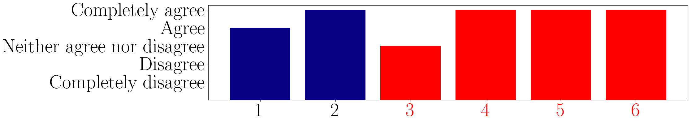 </figure>

##### Q23) The generated audio(s) is consistent with respect to the input prompt
<figure>  </figure>

## P6 (Owner of music label)

| Iteration | Prompt | 
|----|-------------| 
|1|a piano sound| 
|2|beat trap | 
|3|reggeaton beat | 
|4|a reggeaton sound base| 
|5|a sound of drb drill beat| 
|6|a trumpet sound| 
|7|a trumpet sound with brb drill beat| 
|8|a bep pop beat hit | 
|9|a bep pop beat 90s style| 
|10|indie syle| 

##### Q21) The audio(s) generated is consistent with respect to my expectations
<figure>  </figure>

##### Q22) The quality of the audio(s) generated is consistent with my expectations
<figure> 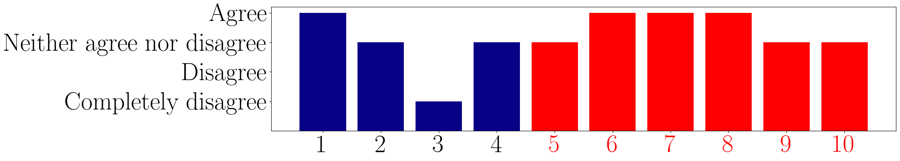 </figure>

##### Q23) The generated audio(s) is consistent with respect to the input prompt
<figure>  </figure>

## P7 (Dj and/or music producer)

| Iteration | Prompt | 
|----|-------------| 
|1|a trap piano with dark notes using a minor scale| 
|2|classic guitar| 
|3|piano with minor scale| 
|4|plm drill beat | 
|5|plm trumpet| 
|6|dmb dembow sound| 
|7|ppp pop guitar| 
|8|ppp pop music with blm style| 
|9|ppp pop music with blm style| 

##### Q21) The audio(s) generated is consistent with respect to my expectations
<figure>  </figure>

##### Q22) The quality of the audio(s) generated is consistent with my expectations
<figure> 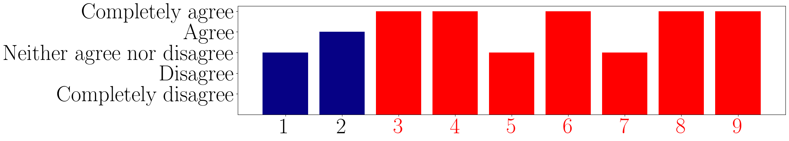 </figure>

##### Q23) The generated audio(s) is consistent with respect to the input prompt
<figure> 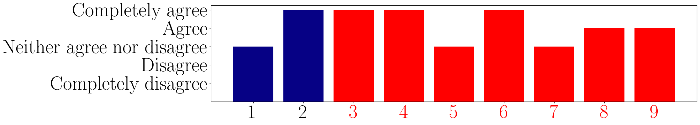 </figure>

## P8 (Singer)

| Iteration | Prompt | 
|----|-------------| 
|1|I like to have a musical style piece with some contamination from progressive rock and something a little bit grotesque| 
|2|I like to have grotesque style piece with some a guitar solo very nostalgic| 
|3|A female voice singing "You are my broken mirror" harmonising the melody of a trumpet solo| 
|4|say "Life in America"| 
|5|jazz club| 
|6|a string quartet that plays a melody to generate tension in the listener| 
|7|singing voice followed by a bass| 
|8|bass melody followed by a singing voice| 
|9|a bass instrument solo followed by a singing voice| 
|10|singing voice followed by a guitar| 
|11|a voice followed by a guitar| 
|12|a guitar solo with a female voice| 
|13|a guitar riff solo with drums| 
|14|a guitar riff solo with drums| 
|15|singing voice in a pop beat| 
|16|a myk singing voice in a pop beat| 
|17|a myk in a pop beat| 
|18|a myk | 
|19|a myk singing voice| 
|20|a myk singing voice in a ppb pop beat| 

##### Q21) The audio(s) generated is consistent with respect to my expectations
<figure>  </figure>

##### Q22) The quality of the audio(s) generated is consistent with my expectations
<figure>  </figure>

##### Q23) The generated audio(s) is consistent with respect to the input prompt
<figure>  </figure>

## P9 (Music player in a band or orchestra)

| Iteration | Prompt | 
|----|-------------| 
|1|Big band | 
|2|Big band style with trumpet solo| 
|3|ska with sax solo| 
|4|ska style with sax solo| 
|5|orchestra playing mahler opera| 
|6|orchestra playing mozart opera| 
|7|orchestra playing bruckner opera| 
|8|trombone playing with mute cup| 
|9|brass instruments playing house music| 
|10|trumpet and saxophone playing house music| 
|11|restaurant ambient music| 
|12|relaxing music for yoga session| 
|13|marching band music style| 
|14|jahloo marching band sound style in the street| 
|15|heavy metal sound| 
|16|blablabla heavy metal sound| 
|17|abc marching band sound in the street| 
|18|abc marching band sound with trombone solo
|19|abc heavy metal music style
|20|abc my way sinatra song

##### Q21) The audio(s) generated is consistent with respect to my expectations
<figure>  </figure>

##### Q22) The quality of the audio(s) generated is consistent with my expectations
<figure>  </figure>

##### Q23) The generated audio(s) is consistent with respect to the input prompt
<figure> 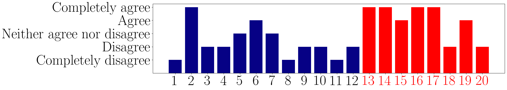 </figure>

## P10 (Dance teacher)

| Iteration | Prompt | 
|----|-------------| 
|1|a fast sound that recalls the speed of the bees| 
|2|light music symbolizing clouds played with a violin| 
|3|final of a show, commercial style, with a rhythm that remains in the mind of the audience| 
|4|hip hop style music with a rhythm that remains in the mind of the audience| 
|5|disco music 80s style with a rhythm that remains in the mind of the audience| 
|6|military march with drums| 
|7|afro music with maracas| 
|8|sounds of triangle instrument on flute base| 
|9|energic music with dj scratch | 
|10|energic music with dj scratch| 
|11|energic music with dj scratch, sks style| 
|12|soft music with xilophone| 
|13|sks disco music 80s  with xilophone instrument| 
|14|sks disco music 80s  with xilophone instrument| 

##### Q21) The audio(s) generated is consistent with respect to my expectations
<figure>  </figure>

##### Q22) The quality of the audio(s) generated is consistent with my expectations
<figure> 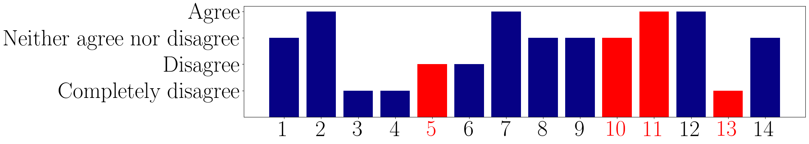 </figure>

##### Q23) The generated audio(s) is consistent with respect to the input prompt
<figure>  </figure>

## P11 (Love to listen to music)

| Iteration | Prompt | 
|----|-------------| 
|1|I see your face before my eyes. I'm falling into darkness. Why must I fight to stay alive? Heores fallen. Wake me can't you hear me calling.| 
|2|I see your face before my eyes. I'm falling into darkness. Why must I fight to stay alive? Heores fallen. Wake me can't you hear me calling.| 
|3|I see your face before my eyes. I'm falling into darkness. Why must I fight to stay alive? Heores fallen. Wake me can't you hear me calling.| 
|4|I see your face before my eyes. I'm falling into darkness. Why must I fight to stay alive? Heores fallen. Wake me can't you hear me calling.| 
|5|I see your face before my eyes. I'm falling into darkness. Why must I fight to stay alive? Heores fallen. Wake me can't you hear me calling, BassSound style | 
|6|I see your face before my eyes. I'm falling into darkness. Why must I fight to stay alive? Heores fallen. Wake me can't you hear me calling, SEEEEEEEEE BassSound music| 
|7|SEEEEEEEEE BassSound | 
|8|Disco 80s| 
|9|Waving flag| 
|10|Waving flag| 
|11|spongebob | 
|12|dragonball| 
|13|dalton| 

##### Q21) The audio(s) generated is consistent with respect to my expectations
<figure>  </figure>

##### Q22) The quality of the audio(s) generated is consistent with my expectations
<figure>  </figure>

##### Q23) The generated audio(s) is consistent with respect to the input prompt
<figure>  </figure>

## P12 (Music player in a band or orchestra)

| Iteration | Prompt | 
|----|-------------| 
|1|spanish anthem| 
|2|sunflower moving with the sun| 
|3|napolitan summer| 
|4|michael jackson disco music style| 
|5|disco music song with drumms| 
|6|drums with topi disco music style | 
|7|spanish entry for eurovision in sweeden| 

##### Q21) The audio(s) generated is consistent with respect to my expectations
<figure>  </figure>

##### Q22) The quality of the audio(s) generated is consistent with my expectations
<figure>  </figure>

##### Q23) The generated audio(s) is consistent with respect to the input prompt
<figure>  </figure>

## P13 (Dj and/or music producer)

| Iteration | Prompt | 
|----|-------------| 
|1|hard lead| 
|2|hard lead | 
|3|make a hard lead with fin thrash metal
|4|make a hard synth lead with fin thrash metal
|5|make a fin hard synth lead 
|6|303
|7|303 bass
|8|drill drums
|9|drill music style drums
|10|hard fin lead synth 
|11|fin hard synth 
|12|fin hard synth sound 

##### Q21) The audio(s) generated is consistent with respect to my expectations
<figure>  </figure>

##### Q22) The quality of the audio(s) generated is consistent with my expectations
<figure>  </figure>

##### Q23) The generated audio(s) is consistent with respect to the input prompt
<figure>  </figure>

## P14 (Music player in a acoustic duo) 

| Iteration | Prompt | 
|----|-------------| 
|1|heavy guitar riff| 
|2|metal singer doing a pig squeal| 
|3|a sound from arr pirate metal| 
|4|pirates singing and metal electric guitar riff| 
|5|alejandro a trash metal track| 
|6|a guitar riff played by james hetfield| 
|7|live stage performance like james hetfield| 
|8|Epic battle soundtrack| 
|9|sks pirate folk music from a tavern| 
|10|sks songs about sea and waves, and finding treasures| 
|11|fantasy anime intro very epic and energetic| 
|12|anime opening| 
|13|happy guy that has finally achieved his bachelor degree| 
|14|shouts of a really happy guy| 
|15|palm mute arpeggio on electric guitar with distortion| 

##### Q21) The audio(s) generated is consistent with respect to my expectations
<figure>  </figure>

##### Q22) The quality of the audio(s) generated is consistent with my expectations
<figure>  </figure>

##### Q23) The generated audio(s) is consistent with respect to the input prompt
<figure>  </figure>

## P15 (Love to listen to music)

| Iteration | Prompt | 
|----|-------------| 
|1|rock style| 
|2|roar sound lion| 
|3|river sound| 
|4|oppenheimer | 
|5|champions league| 
|6|door close| 
|7|shot gun sound| 
|8|sound of a gunshot| 
|9|pem pem| 
|10|car engine| 
|11|a sound of dmc disco music| 
|12|a sound of the rain| 
|13|a sound of the rain in a disco music| 
|14|dmc sound of water| 
|15|sound of police car| 
|16|bomb explosion| 
|17|harry potter music| 
|18|shark attack| 
|19|football score| 
|20|scissors cut| 
|21|glass broke| 
|22|pop corn explosion| 
|23|wake| 
|24|tempest| 
|25|storm| 

##### Q21) The audio(s) generated is consistent with respect to my expectations
<figure> 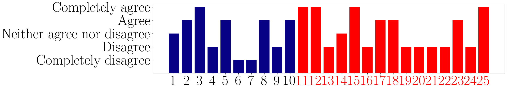 </figure>

##### Q22) The quality of the audio(s) generated is consistent with my expectations
<figure> 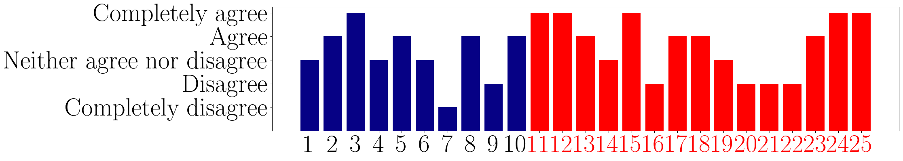 </figure>

##### Q23) The generated audio(s) is consistent with respect to the input prompt
<figure>  </figure>

## P16 (Love to listen to music)

| Iteration | Prompt | 
|----|-------------| 
|1|A sound of an electric guitar| 
|2|A flute playing "My heart will go on" by Celine Dion| 
|3|A ballad in the style of sas pirate metal| 
|4|A jazz music in the style of sas| 
|5|A doom metal music in the style of sas pirate metal| 
|6|A 90's disco hit in the style of sas pirate metal| 
|7|Vegeta singing a song in the style of sas pirate metal| 
|8|"Epic sax guy" in the style of sas pirate metal| 
|9|A dog barking in the style of sas pirate metal| 
|10|A dog barking in the style of pirate metal| 
|11|A rubber chicken singing a song in the style of sas pirate metal| 
|12|a sas pirate metal song, but with the lyrics made by a door bell ring| 

##### Q21) The audio(s) generated is consistent with respect to my expectations
<figure>  </figure>

##### Q22) The quality of the audio(s) generated is consistent with my expectations
<figure> 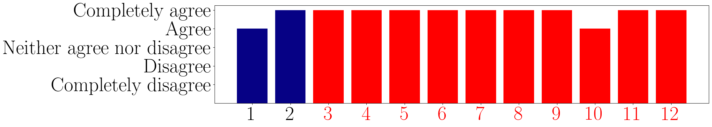 </figure>

##### Q23) The generated audio(s) is consistent with respect to the input prompt
<figure>  </figure>

## P17 (Music player in a band or orchestra)

| Iteration | Prompt | 
|----|-------------| 
|1|a sound of guitar| 
|2|a sound of piano| 
|3|a sound of electric guitar| 
|4|a sound of country guitar| 
|5|a sound of rock guitar| 
|6|sks acustic guitar sound| 
|7|acoustic sound in the style of sks| 
|8|acoustic guitar| 
|9|acoustic guitar| 
|10|acoustic syle with sks| 
|11|sks in acoustic style music| 
|12|acoustic style music guitar| 

##### Q21) The audio(s) generated is consistent with respect to my expectations
<figure>  </figure>

##### Q22) The quality of the audio(s) generated is consistent with my expectations
<figure>  </figure>

##### Q23) The generated audio(s) is consistent with respect to the input prompt
<figure>  </figure>

## P18 (Music player in a band or orchestra)

| Iteration | Prompt | 
|----|-------------| 
|1|flute with piano and guitar, environmental audio| 
|2|adagio flute| 
|3|adagio flute| 
|4|adagio flute| 
|5|adagio flute with marimba| 
|6|adagio flute with marimba and piano| 
|7|adagio flute with piano and marimba| 
|8|jazz music with flute| 

##### Q21) The audio(s) generated is consistent with respect to my expectations
<figure>  </figure>

##### Q22) The quality of the audio(s) generated is consistent with my expectations
<figure>  </figure>

##### Q23) The generated audio(s) is consistent with respect to the input prompt
<figure> 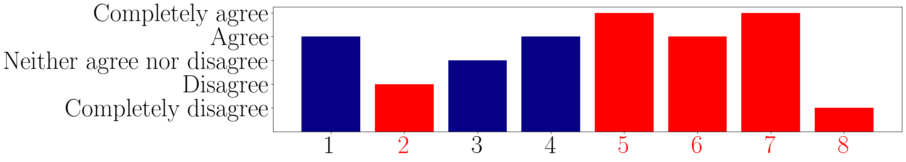 </figure>

## P19 (DJ or/and music producer)

| Iteration | Prompt | 
|----|-------------| 
|1|daft punk style song| 
|2|coldplay| 
|3|slow guitar ballad with soft drums and a bass| 
|4|green day punk sad song| 
|5|green day acoustic | 
|6|green day punk acoustic | 
|7|green day punk acoustic guitar | 
|8|electro punk| 
|9|synth punk| 
|10|edm green day| 
|11|edm punk| 
|12|linkin park | 
|13|annalisa| 
|14|reggaeton punk| 
|15|reggaeton punk| 

##### Q21) The audio(s) generated is consistent with respect to my expectations
<figure>  </figure>

##### Q22) The quality of the audio(s) generated is consistent with my expectations
<figure>  </figure>

##### Q23) The generated audio(s) is consistent with respect to the input prompt
<figure> 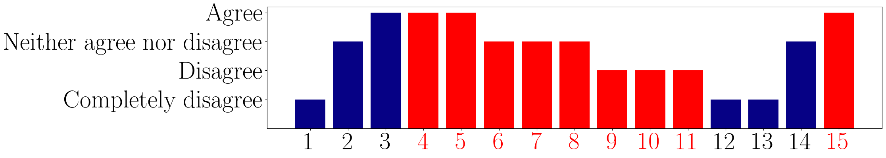 </figure>

## P20 (Conservatory student)

| Iteration | Prompt | 
|----|-------------| 
|1|liuth sound| 
|2|lute sound| 
|3|duck| 
|4|seagulls| 
|5|shakira latin music| 
|6|gypsy music| 
|7|satan| 
|8|little marmaide| 
|9|baby shark| 
|10|baby shark latin music| 

##### Q21) The audio(s) generated is consistent with respect to my expectations
<figure>  </figure>

##### Q22) The quality of the audio(s) generated is consistent with my expectations
<figure>  </figure>

##### Q23) The generated audio(s) is consistent with respect to the input prompt
<figure>  </figure>

## P21 (Former band member, amateur arranger)

| Iteration | Prompt | 
|----|-------------| 
|1|regular cowbell| 
|2|steady vocal note followed by volatinas of a soprano| 
|3|bebop party music sung by male singer| 
|4|orchestral soundtrack for a dramatic, thrilling scene| 
|5|tense, serious, dark scene of shooting game with deep bass effects| 
|6|shooting videogame scene with deep bass and slow shooting drum| 
|7|crime scene for hot shot videogame with slow bass shots in the beginning, fast rhythm after, accompained with deep bass fx| 
|8|music for a cliffhang moment videogame shot drum and bass| 
  
##### Q21) The audio(s) generated is consistent with respect to my expectations
<figure>  </figure>

##### Q22) The quality of the audio(s) generated is consistent with my expectations
<figure> 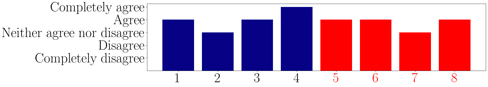 </figure>

##### Q23) The generated audio(s) is consistent with respect to the input prompt
<figure> 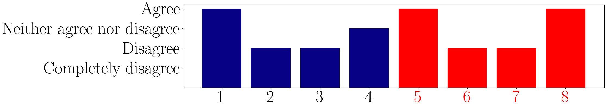 </figure>

## P22 (Love to listen to music)

| Iteration | Prompt | 
|----|-------------| 
|1|The sound of two metal objects clashing under water| 
|2|The sound of a guitar in a soundproof room| 
|3|The sound of a guitar in a soundproof room and i'm listening from inside the room| 
|4|The sound of a  guitar on the stage of a theater| 
|5|A sound of dm90| 
|6|A sound of dm90 disco music 90s| 
|7|A sound of an explosion| 
|8|the sound of a voice of a single person| 
|9|the sound of a single person talking| 
|10|the sound of a single person talking in italian| 
|11|the sound of drum in space| 
|12|The sound of music from a hooligan's car| 
|13|A j-pop music| 
|14|the sound of a 56k modem| 
|15|A disco music played on a typewriter| 
|16|the sound of a harpsichord and a piano playing the same song

##### Q21) The audio(s) generated is consistent with respect to my expectations
<figure>  </figure>

##### Q22) The quality of the audio(s) generated is consistent with my expectations
<figure>  </figure>

##### Q23) The generated audio(s) is consistent with respect to the input prompt
<figure>  </figure>

## P23 (Solo artist)

| Iteration | Prompt | 
|----|-------------| 
|1|A head smashed on a snare drum| 
|2|Distorted bagpipe playing jazz| 
|3|underwater bossa nova classical guitar| 
|4|Punk drum fill| 
|5|slap bass with wah wah| 
|6|askebbenifaf thrash metal but hip hop
|7|askebbenifaf thrash metal hip hop
|8|askebbenifaf hip hop
|9|yeere drill metal
|10|yeere ethnic
|11|yeere thrash metal
|12|yeere violin
|13|yeere drill violin

##### Q21) The audio(s) generated is consistent with respect to my expectations
<figure>  </figure>

##### Q22) The quality of the audio(s) generated is consistent with my expectations
<figure> 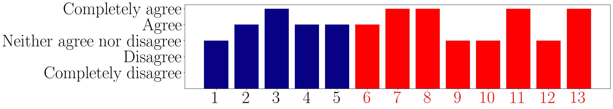 </figure>

##### Q23) The generated audio(s) is consistent with respect to the input prompt
<figure> 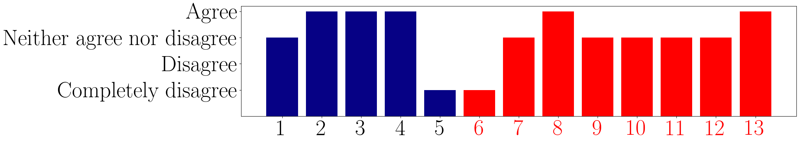 </figure>

## P24 (Dance teacher)

| Iteration | Prompt | 
|----|-------------| 
|1|a sound of violin| 
|2|a sound that reminds to dark emotion| 
|3|music that recalls the melancholy reffering to rain | 
|4|two lovers sitting in a park | 
|5|dancing in a toy shop| 
|6|sleeping sobbing| 
|7|sleeping snoring| 
|8|a string concert with harpsichord| 
|9|a vocal trance female music | 
|10|a sound of breaking bottles of glass| 
|11|a sound of breaking bottles of glass| 

##### Q21) The audio(s) generated is consistent with respect to my expectations
<figure>  </figure>

##### Q22) The quality of the audio(s) generated is consistent with my expectations
<figure> 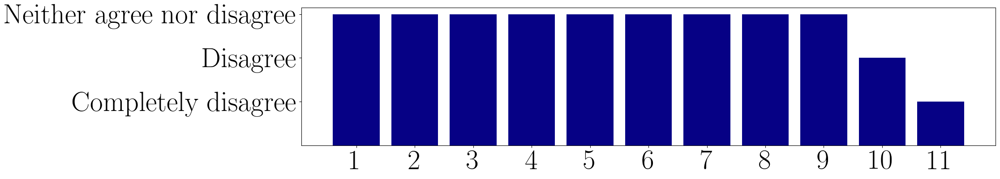 </figure>

##### Q23) The generated audio(s) is consistent with respect to the input prompt
<figure> 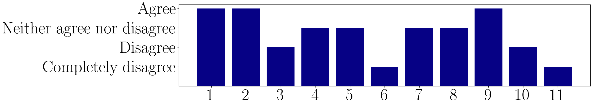 </figure>

