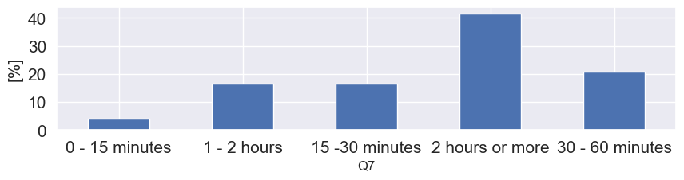
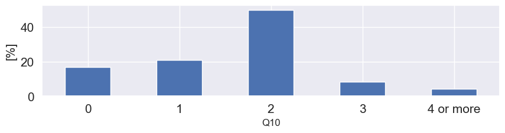
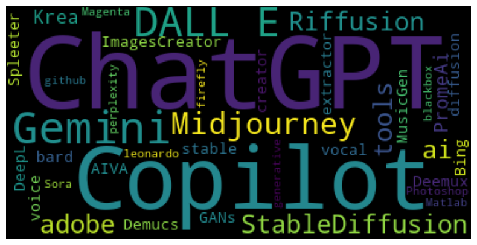
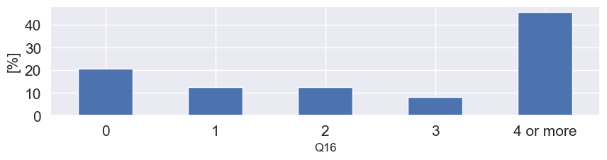

# Musical knowledge and experience with AI tools

## Questions and type of questions

| ID  | Question  |  Type | 
|:---|:---|:---|
| Q1  |  I spend a lot of my free time doing music-related activities |  A |
| Q2  |  I enjoy writing about music, for example on blogs and forums |  A  |
| Q3  | If somebody starts singing a song I don’t know, I can usually join in  |  A  |
| Q4  |  I can sing or play music from memory |   |
| Q5  |  I often read or search the internet for things related to music |  A  |
| Q6  |  I am able to identify what is special about a given musical piece  |  A  |
| Q7  | I listen to music for _______ per day  | B  |
| Q8  |I engaged in regular, daily practice of a musical instrument (including voice) for ____ years| C  |
| Q9  |At the peak of my interest, I practiced _____ hours per day on my primary instrument.|  C |
| Q10  |I can play ______ musical instruments.|   C|
| Q11  |What kind of instrument can you play? Ex: piano, guitar, flute, etc...|   D|
| Q12  |I often read or search the internet for things related to AI tools.| A  |
| Q13  |AI can be a tool to support human activities.|A   |
| Q14  |Were you already aware of the existence of AI tools? Which ones ?| D  |
| Q15  |Do you use AI tools? Which ones ?| D  |
| Q16  |I’m able to use _____ programming languages.| C  |
| Q17  |I spend _______ on programming languages.|B   |
| Q18  |What is your relationship with music ?| O  |
| Q19  |Were you already aware of the existence of AI tools in text-to-music? Which ones ?|D   |
| Q20  |Do you use text-to-music AI tools ? Which ones ?| D  |

## Answers to _Musical knowledge and experience with AI tools_ survey

<figure>
  
  <figcaption style="display: block; text-align: center; margin: 0 auto;">Answers evaluated on a Likert scale</figcaption>
</figure>

### Q7) _I listen to music for _______ per day._
<figure>
  
</figure>

### Q8) _I engaged in regular, daily practice of a musical instrument (including voice) for ____ years_
<figure>
  
</figure>

### Q9) _At the peak of my interest, I practiced _____ hours per day on my primary instrument._
<figure>
  
</figure>

### Q10) _I can play ______ musical instruments._
<figure>
  
</figure>

### Q11) _What kind of instrument can you play? Ex: piano, guitar, flute, etc..._
<figure>
  
    <figcaption>N.B. 15.7 % answered  <i>I do NOT play any instrument </i></figcaption>
</figure>

### Q14) _Were you already aware of the existence of AI tools? Which ones?_
  <figure>
  
    <figcaption>N.B. 16.7 % answered  <i>No, I don't</i> and 8.3% answered <i>Yes, but I don’t remember the names </i></figcaption>
</figure>

### Q15) _Do you use AI tools? Which ones?_
  <figure>
  
    <figcaption>N.B. 33.3 % answered  <i>No, I don't</i> and 4.2% answered <i>Yes, but I don’t remember the names </i></figcaption>
</figure>

### Q16) _I’m able to use _____ programming languages._
  <figure>
  
</figure>

### Q17) _I spend _______ on programming languages._
<figure>
  
</figure>

### Q18) _What is your relationship with music?_
  <figure>
  
</figure>

Participants who chose *other* gave the following answers:

- Dj/Mixing Engineer

- Music producer, musician

- I simply love listen to music and play non professionally

- I am the owner of a small record label<superscript>*</superscript>

- I'm a singer and I love to listen to new stuff and new genres

- I am a dance teacher, I work with music<superscript>*</superscript>

- both listener and playing in an acoustic duo

- I study in the conservatory

- Former student, former band member, amateur arranger
  
- I am a solo artist

- Dance Teacher<superscript>*</superscript>

<superscript>*</superscript> answers translated 

### Q19) _Were you already aware of the existence of AI tools in text-to-music? Which ones?_
<figure>
  
<figcaption>N.B. 37.5 % answered  <i>No, I don't</i> and 37.5% answered <i>Yes, but I don’t remember the names </i></figcaption>
</figure>

### Q20) _Do you use text-to-music AI tools? Which ones?_
<figure>
  
</figure>
