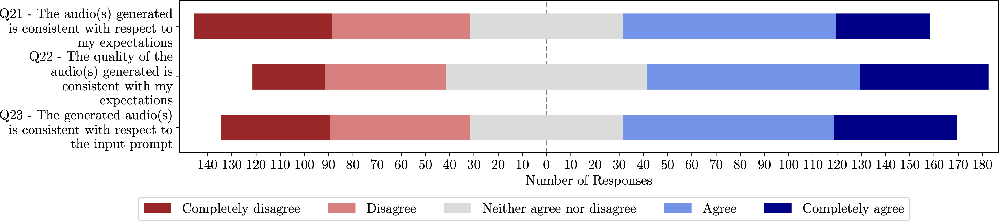

# Text-to-Music Interaction (Model Evaluation) 

## Questions and type of questions

| ID  | Question  |  Type | 
|:---|:---|:---|
| Q21  |  The generated audio(s) is consistent with respect to the input prompt  |  A |
| Q22  |  The audio(s) generated is consistent with respect to my expectations |  A  |
| Q23  | The quality of the audio(s) generated is consistent with my expectations  |  A  |

## Answers to questions evaluated on a Likert Scale
<figure>
  
  <figcaption style="display: block; text-align: center; margin: 0 auto;">Questionnaire answers</figcaption>
</figure>
